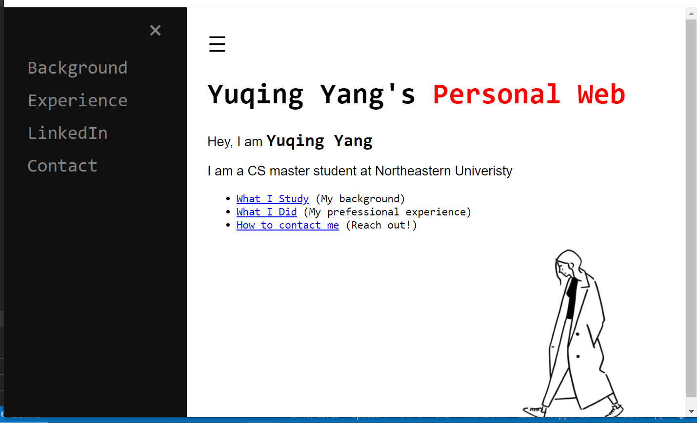

# PersonalWebsite-YuqingYang

## Components introduction

This personal web contains:

* A landing page with a interactive side menu

Before clicking the side menu on the top left corner

After clikcing the side menu

* Three internal links includes background page, experience page and contact page

- Background page used a splited layout in CSS to seperate the screen into two parts and it also has two buttons to navigate to the previous page (home page) to the next page (experience)

- Experience page used a HTML table, with CSS styling. The columns of the table will be seperated equally with different screen size

- Contact page used a fade in effects from JQuery to show the contact cards

* One external link for LinkedIn

This link can be accessed from the navigation menu on the landing page and it will open a new tab by clicking the link

This web has been tested from different screen size and it behave in a reasonable way in different browser or a mobile device
 
Heroku Link:

https://personalweb-yuqingyang.herokuapp.com/index.html

